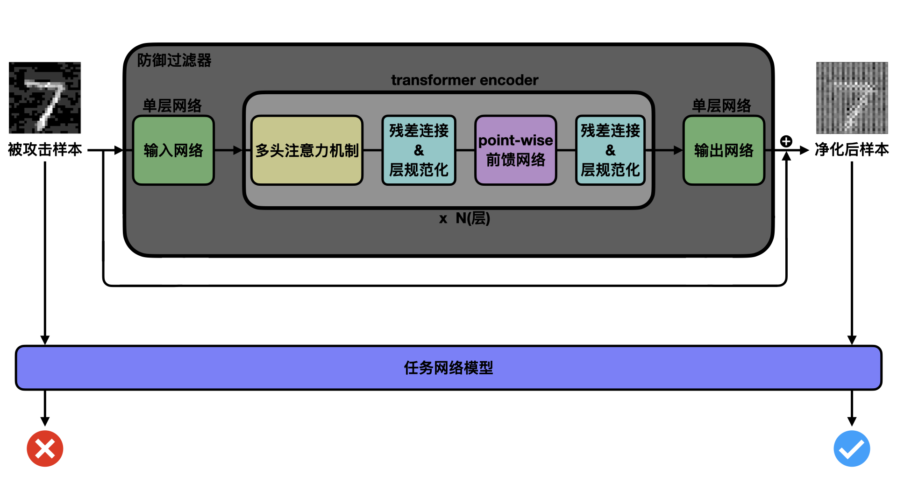
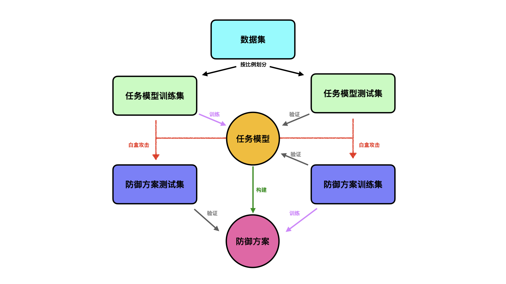
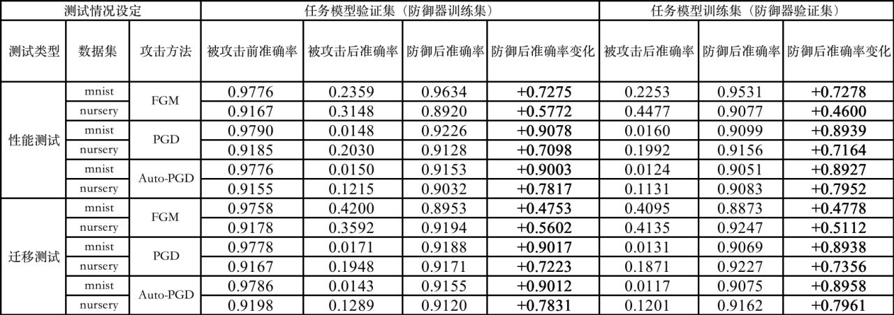

# defense-filter

针对测试样本攻击，第一个通过将文本预训练模型迁移作为过滤器主体的净化防御方案，其在不同模态数据集、不同攻击手段时均能够达到不错的防御效果。此外，经验证，我们的方案具有可迁移能力，能够仅利用少量数据集快速迁移至不同场景，在保证防御性能的同时，极大地节约资源，为我国双碳目标以及全球环境保护助力。（详细内容见报告）

**训练好的权重文件、效果示意图、损失曲线以及带输出结果的ipynb文件在[此网盘链接](https://pan.baidu.com/s/1UnV9_KNtTIfC49geTnpeug?pwd=2bbb)中：**
https://pan.baidu.com/s/1UnV9_KNtTIfC49geTnpeug?pwd=2bbb

目录
- [依赖](#依赖)
- [快速开始](#快速开始)
- [关于方案](#关于方案)
  - 方案框架图
  - 实验测试流程图
  - 测试结果表

## 依赖

jupyter matplotlib numpy tqdm torch adversarial-robustness-toolbox transformers

## 快速开始

本仓库中每个ipynb文件对应一个实验设定，由命名区分。其中以“攻击方式_数据集.ipynb”命名的为性能测试，以“攻击方式_数据集a2数据集b.ipynb”命名的为由数据集a得到的模型迁移于数据集b的测试。

用jupyter notebook打开对应ipynb文件依次运行即可。

**（亦可在本文开头链接中直接获取训练好的权重文件、效果示意图、损失曲线以及带输出结果的ipynb文件）**

如果想加载模型权重，可用如下方式：

```
网络实例名.load_state_dict(torch.load("权重名.pdparams"))
```

## 关于方案

**（如图片加载失败可至pics目录下查看各图片）**

方案整体如下图所示：



实验测试流程如下图所示：



实验结果如下表所示：


